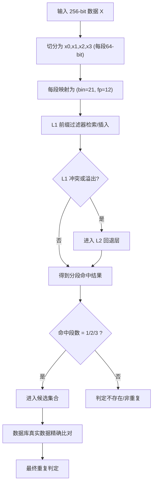

# newfilter256 需求文档（草案 v1）

## 1. 目标
- 新建模块目录：`newfilter256/`
- 面向 `256-bit` 输入数据，按 `4 x 64-bit` 分段处理。
- 结合 Prefix-Filter 思路（两层结构）与当前 `newFilter` 的最终库比对逻辑。
- 目标存储规模：千万级数据（10M+）。

## 2. 固定参数（本版）
- 分段数：`4`（每段 `64-bit`）
- 每桶容量（bucket size）：`16`
- 指纹位数：`fp = 12`
- 桶号位数：`bin = 21`
- 负载因子上限：`\alpha = 0.95`

## 3. 容量估算
单段过滤器容量近似：

\[
N_{segment} \approx 2^{bin} \times bucket\_size \times \alpha
\]

代入本版参数：

\[
N_{segment} \approx 2^{21} \times 16 \times 0.95 = 31,876,915 \ (\approx 3188万)
\]

说明：
- 该量级可覆盖“千万级”目标。
- 实际可用容量会受冲突、装载策略、L2 回退与数据分布影响。

## 4. 数据路径设计
对每个 256-bit 元素 `X`：
- 切分为 `x0, x1, x2, x3`（每段 64-bit）。
- 每段通过哈希映射为 `(bin_i, fp_i)`：
  - `bin_i`: 21 位桶号
  - `fp_i`: 12 位指纹
- 写入对应前缀过滤器（可选“4 个过滤器”或“1 个过滤器 + segment_id”实现）。

## 5. 查询与判重策略
查询时：
- 同样将 `Xq` 切分为 `x0..x3`，得到 4 组 `(bin_i, fp_i)`。
- 在前缀过滤器两层结构中检索候选。
- 根据命中段数进行分支：
  - `1 段相同`：加入候选集合（低置信）
  - `2 段相同`：加入候选集合（中置信）
  - `3 段相同`：加入候选集合（高置信）
- 对候选执行“数据库真实数据比对”（与现有 `newFilter` 类似）做最终判定。

## 6. 两层结构（Prefix-Filter 风格）
- **L1（主桶层）**：按 `bin` 定位桶，快速匹配 `fp`。
- **L2（回退层）**：处理 L1 溢出或冲突候选。
- 查询流程：优先 L1，必要时进入 L2，最终输出候选给数据库精确比对。

## 7. 流程图式说明

## 8. 实现边界（当前阶段）
- 当前仅落地需求文档，不包含代码实现与测试脚本。
- 后续实现建议：
  1. 定义 `newfilter256` 的核心数据结构与接口；
  2. 加入分段命中统计（1/2/3 段）；
  3. 接入 benchmark 与可视化脚本。
